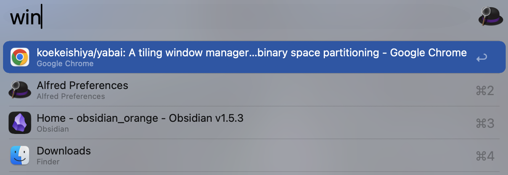

A Alfred workflow using [yabai](https://github.com/koekeishiya/yabai) to switch between windows

> **Note**: [yabai](https://github.com/koekeishiya/yabai) and [jq](https://github.com/jqlang/jq) shoule be installed.
> - Use `yabai -m query --windows` to get all windows info
> - Use `yabai -m space --focus 2` and `yabai -m window window-id` to switch to specific window
> - Use `jq` to handle data

## Usage

1. Input keyword `win`

2. Press `↩︎` to switch

